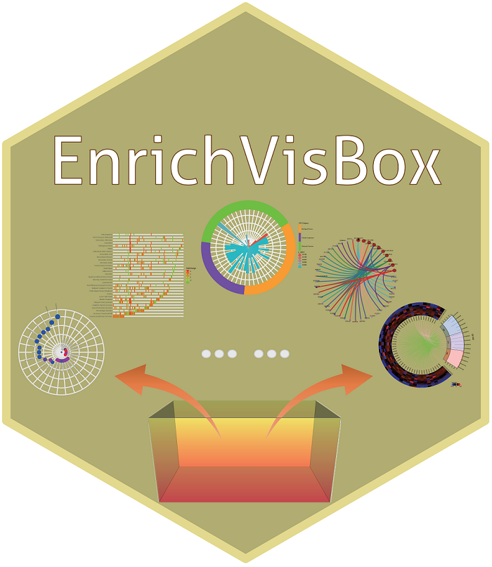

# EnrichVisBox

#### A web toolbox for visualizing functional enrichment results

## 1. Brief Description
**<font size='5'> EnrichVisBox </font>** is a free, user-friendly and powerful software for visualization of the functional enrichment analysis results, including bubble plot, UpSet plot, polar bar plot, rectangle plot, ridgeline plot, network plot, and variant chord plot. It is developed with [R](https://www.r-project.org/) and an example is shown here: [https://www.omicsolution.com/wukong/EnrichVisBox/](https://www.omicsolution.com/wukong/EnrichVisBox/).

## 2. Detailed Introduction
The usage about this tool can be found here:
[https://github.com/wangshisheng/EnrichVisBox/blob/master/Supplementary_Notes.pdf](https://github.com/wangshisheng/EnrichVisBox/blob/master/Supplementary_Notes.pdf).

## 3. Run EnrichVisBox locally
If users want to run this tool on their own computer, they should install R and RStudio first, as shown below:
- **Install R**. You can download R from here: [https://www.r-project.org/](https://www.r-project.org/).
- **Install RStudio** (Recommendatory but not necessary). You can download RStudio from here: [https://www.rstudio.com/](https://www.rstudio.com/).
- **Install dependent R packages**. Perhaps users need to install some packages, such as: shiny, shinyjs, shinyBS, ggsci, DT, openxlsx, gdata, ComplexHeatmap, UpSetR, glue, ggplot2, DOSE, reshape2, ggridges, clusterProfiler, enrichplot, circlize.

You can download our tool from this github and unzip the file, the source codes are in the SourceCodes file, then run:
```r
#Find the file path and run 
library(shiny)
runApp(".../EnrichVisBox/SourceCodes")
```

## 4. Example Figures


## 5. Other References
5.1 Wickham H. [ggplot2](https://ggplot2.tidyverse.org): elegant graphics for data analysis.

5.2 Yu G, Wang L, Han Y and He Q. [clusterProfiler](https://yulab-smu.github.io/clusterProfiler-book): an R package for comparing biological themes among gene clusters. OMICS: A Journal of Integrative Biology. 2012, 16(5):284-287.

5.3 Conway JR, Lex A, Gehlenborg N. [UpSetR](https://doi.org/10.1093/bioinformatics/btx364): an R package for the visualization of intersecting sets and their properties. Bioinformatics. 2017;33(18):2938-2940.

5.4 Gu Z, Gu L, Eils R, Schlesner M, Brors B. [circlize](https://academic.oup.com/bioinformatics/article/30/19/2811/2422259) implements and enhances circular visualization in R. Bioinformatics. 2014;30(19):2811-2812.
